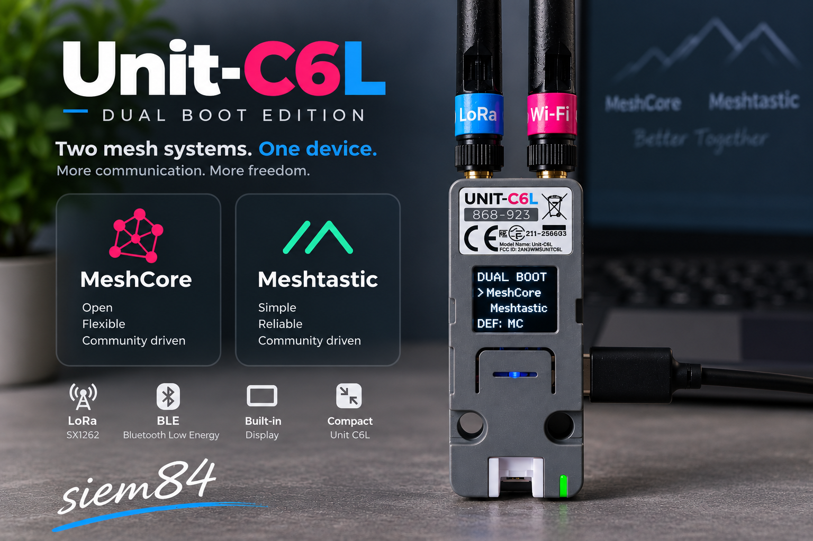

[English](README.md) | [Polski](README_PL.md)

# M5Stack Unit C6L — MeshCore + Meshtastic DualBoot
## O projekcie

M5Stack Unit C6L to małe urządzenie z radiem LoRa, które może pracować z różnymi systemami mesh. Ten projekt powstał po to, żeby nie trzeba było wybierać tylko jednego z nich. Zamiast za każdym razem wgrywać inne firmware, urządzenie może uruchomić MeshCore albo Meshtastic — wybór odbywa się bezpośrednio z prostego menu na ekranie.

Podstawą projektu była moja wcześniejsza wersja **[MeshCore-M5Stack-Unit-C6L-UI](https://github.com/siem84/MeshCore-M5Stack-Unit-C6L-UI)**, przygotowana specjalnie dla M5Stack Unit C6L i rozwijana na bazie oficjalnego projektu MeshCore. Do niej została dołączona oficjalna wersja Meshtastic oraz mechanizm DualBoot, który pozwala korzystać z obu systemów na jednym urządzeniu.

Najważniejsze założenie było proste: **jedno C6L, dwa systemy i możliwie łatwa obsługa bez ciągłego przeprogramowywania urządzenia.**

Życzę udanej zabawy  
**siem84 (siemkowsky)**

DualBoot dla **M5Stack Unit C6L**, łączący:

- **MeshCore Companion Radio BLE**
- **Meshtastic**
- natywne przełączanie partycji OTA ESP32-C6
- menu startowe na OLED
- animację startową Radio Rain
- trwały wybór systemu domyślnego

## Aktualna wersja

**v0.3.0-beta**

Wersja przetestowana na rzeczywistym urządzeniu M5Stack Unit C6L.

### Pochodzenie projektu

| Komponent | Baza |
|---|---|
| MeshCore dla C6L | wcześniejszy projekt/port MeshCore dla M5Stack Unit C6L autorstwa `siem84` |
| Pierwotna baza upstream MeshCore | `dev` / `ac7d88e` |
| Meshtastic | oficjalny `2.7.26` / `54e0d8d` |
| C6L DualBoot UI | `v0.3.0` |

MeshCore używany w tym projekcie DualBoot **nie jest nowym portem wykonanym bezpośrednio ze standardowego oficjalnego MeshCore**.

Bazą jest wcześniej opracowana i działająca **wersja MeshCore dla M5Stack Unit C6L autorstwa siem84**, która pierwotnie powstała na bazie oficjalnego projektu MeshCore. W obecnym projekcie DualBoot ta wersja C6L została dalej rozwinięta o obsługę DualBoot, menu startowe, Radio Rain, trwały wybór systemu domyślnego oraz poprawki związane z pamięcią.

Publiczny patch MeshCore jest przygotowany względem wskazanej rewizji oficjalnego MeshCore, dzięki czemu z oficjalnej bazy można odtworzyć pełny zestaw zmian C6L + DualBoot.

## Uruchamianie

Po włączeniu urządzenia:

1. Wyświetlana jest animacja **Radio Rain** przez około 5 sekund.
2. Pojawia się menu DualBoot.
3. System wybierany jest przyciskiem USER.

### Obsługa przycisku USER

- krótkie naciśnięcie — zmiana `MeshCore / Meshtastic`
- przytrzymanie **1–3 s** — uruchomienie zaznaczonego systemu
- przytrzymanie **3 s lub dłużej** — zapisanie zaznaczonego systemu jako domyślnego
- brak działania przez **10 s** — automatyczny start zapisanego systemu domyślnego

Na OLED wyświetlane są komunikaty:

- `START: MC` / `START: MT`
- `SET DEF: MC` / `SET DEF: MT`
- `DEF: MC` / `DEF: MT`

Po czystej instalacji systemem domyślnym jest **MeshCore**.

## Architektura DualBoot

Projekt nie używa osobnej aplikacji boot-menu.

Wykorzystywane są natywne partycje OTA ESP32-C6:

- `ota_0` / `app0` → MeshCore
- `ota_1` / `app1` → Meshtastic

Menu startowe znajduje się w MeshCore.

Po wybraniu Meshtastic urządzenie przełącza partycję OTA i wykonuje restart.

Po kolejnym normalnym restarcie Meshtastic urządzenie wraca do MeshCore i ponownie pokazuje menu DualBoot.

## Pamięć i system plików

MeshCore i Meshtastic używają osobnych partycji SPIFFS:

- Meshtastic: `spiffs`
- MeshCore: `mc_spiffs`

MeshCore zawiera poprawkę dla DualBoot C6L, dzięki której zapis ustawień i konfiguracji działa na właściwej partycji `mc_spiffs`.

## Instalacja

Instrukcja instalacji:

[INSTALL.md](INSTALL.md)

## Szczegóły techniczne

Opis architektury i układu partycji:

[TECHNICAL.md](TECHNICAL.md)

## Zmiany źródłowe

Czyste patche źródłowe znajdują się w katalogu:

`patches/`

Patche są przeznaczone do zastosowania na odpowiednich rewizjach projektów bazowych.

## Status projektu

Przetestowano sprzętowo:

- komunikację MeshCore przez BLE
- import konfiguracji MeshCore
- trwały zapis ustawień MeshCore
- odbiór LoRa w MeshCore
- nadawanie LoRa w MeshCore
- uruchamianie Meshtastic
- przełączanie MC ↔ MT
- trwały wybór systemu domyślnego
- automatyczny start po 10 sekundach
- menu OLED
- animację Radio Rain

## Projekty bazowe

- MeshCore: https://github.com/meshcore-dev/MeshCore
- Meshtastic firmware: https://github.com/meshtastic/firmware

Ten projekt jest niezależną modyfikacją społecznościową i nie jest oficjalnym wydaniem MeshCore, Meshtastic ani M5Stack.

## Licencje

Informacje o licencjach:

[LICENSES.md](LICENSES.md)
